# E-Commerce Store Data Analysis
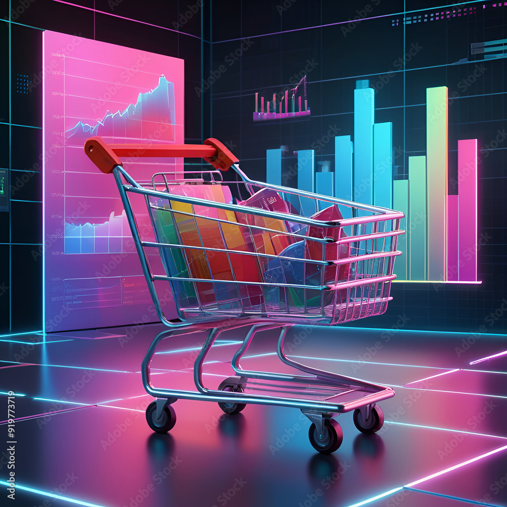
---
## Introduction
This Excel project focuses on analyzing the sales of an e-commerce store. It aims to provide actionable insights that can help the store make data-driven decisions to enhance sales, improve customer retention, and boost operational efficiency.

## Skills Demonstrated
Excel features like 
- pivot tables
- Vlookup
- date function
- text function
- filtering
- sorting
- visualization, etc were demonstrated in this project.

## Problem Statement
The project aims to seek answers to the following questions;
1. What are the monthly/yearly sales and profits?
2. What product categories are the top performers? And what are their contributions to the revenue?
3. What percentage of the customers are returning?
4. What region has the highest and lowest sales?
5. What possible factors affect sales in these regions?
6. How does the delivery status impact sales and customer satisfaction in various regions?
7. How do the different shipping options affect delivery performance?
8. What customer segment shows the most interest in a specific product or category?

## Methodology
### Data Cleaning
#### Removing Duplicates
I converted the data into a table to enable me to use the filter drop-down buttons effectively. I used Ctrl + A to highlight the dataset and clicked “Remove duplicate” in the data ribbon. There was no duplicate value in the dataset. 
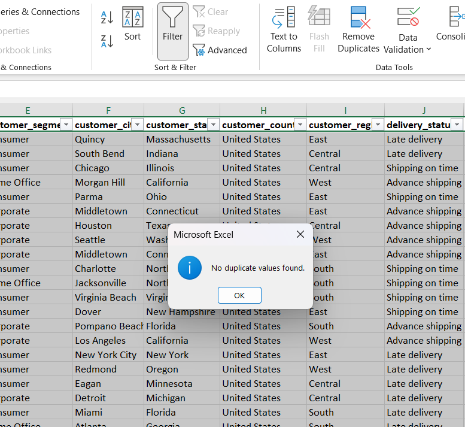

#### Spell-Checking
I used the filter button to check all the columns in the dataset. I noticed some columns had misspelled words that were stored differently. 
So I used the find and replace function to change the spelling to their correct format. I changed Tech – Technology, Furnitures – Furniture in the category_name column. I also corrected the misspelled words in the delivery_status and the customer segment columns.
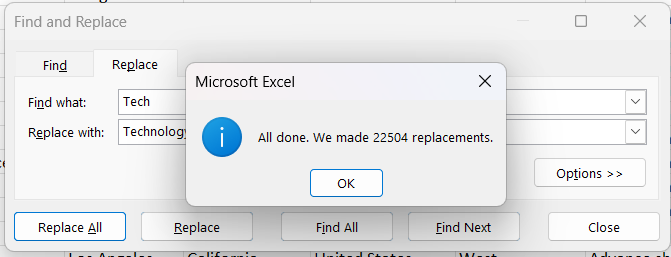   |   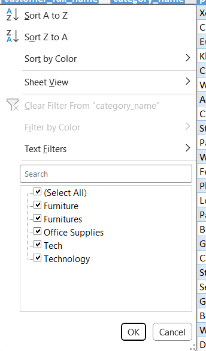     |    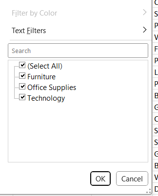

#### Date Formatting
Some values in the order_date and the shipping_date were stored as numbers. To change this format to date, I did the following:
Select the column > click on the data ribbon > text to column > Delimiter > leave all the delimiters unselected and click next > Date (DMY) > Finish. This has changed the format of the column to date.
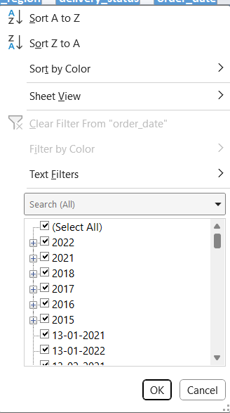                               |     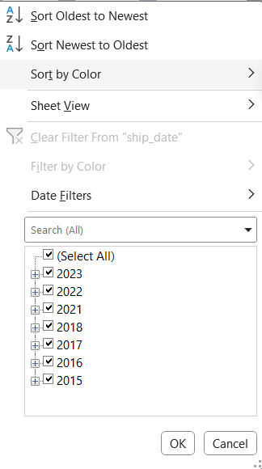

#### Blanks
I checked for blanks in the data by highlighting the whole dataset, using the “Go to special” in the find and select ribbon, I selected blanks and clicked ok. No blanks were found in the dataset.
Finally, to give the table a more appealing and uniform look, I aligned all to the center.
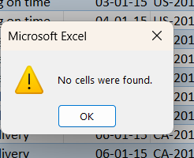

## Exploratory Data Analysis
### 1. What are the monthly/yearly sales and profits?
I extracted the months and the years from the shipping dates. Then, I used pivot tables to tabulate the months, years, and the sum of sales per order and the sum of profit per order. I used a combined chart to visualize the yearly profit and sales; I used a bar chart to visualize the monthly sales and the monthly profit.

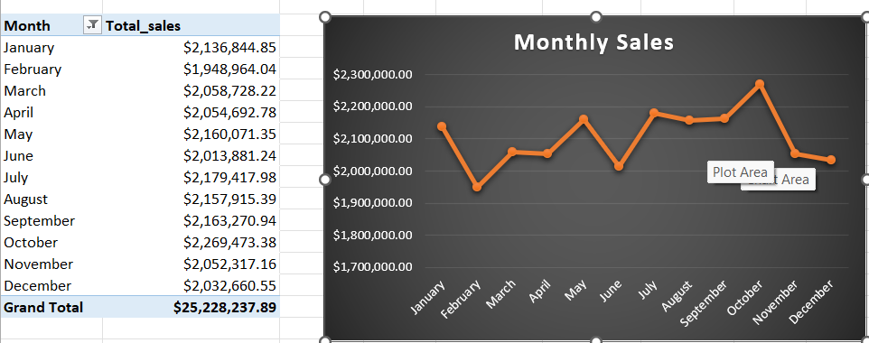
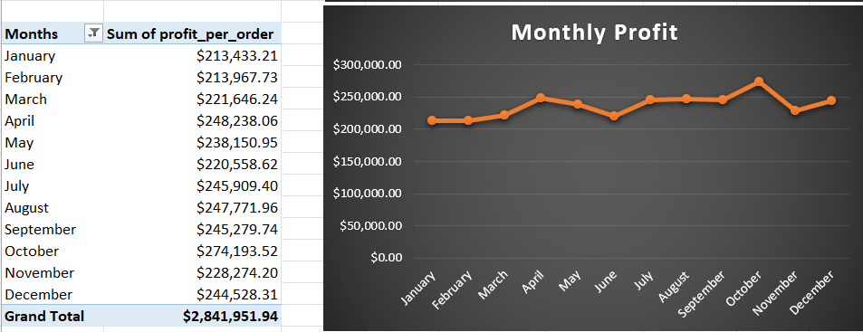
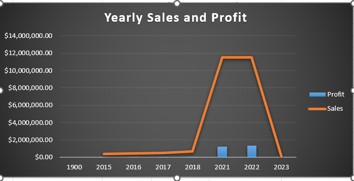
The monthly sales and profit shows that the peak of sale and profit are in October. The sales can also be seen rising between 2018 and 2021 before dropping again in 2023

### 2. What product categories are the top performers? And what are their contributions to the revenue?
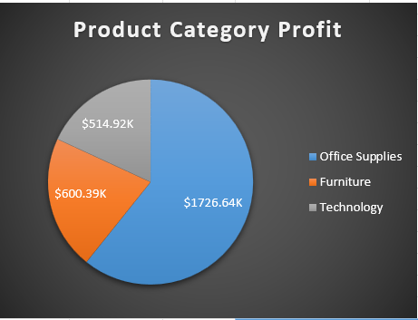

In the product category, it can be seen that Office Supply generated the highest amount of profit, amounting to $1726.64K  while Technology contributed $514.92K in total over the years.

### 3. What percentage of the customers are returning?
To get the percentage of returning customers from the data, I used COUNTA(Worksheet!B:B) to count the total number of customers, using the customer full name column and ROW(UNIQUE(Worksheet!B:B) to count the unique customers in that column. I subtracted the Unique customers from the Total customers to get the number of returning customers and then applied this formula to calculate the percentage of returning customers
Returning Customer Percentage = (Returning Customers/ Total Customers) x 100
this gave me 62.17%. This shows that more than half of the customers return to make more purchases from the store.

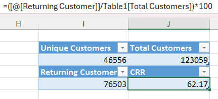

### 4. What region has the highest and lowest sales?
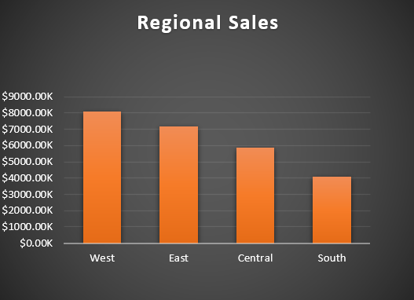

Analysing the total sales over the years by different customer regions, it was found that the Western region has the highest amount of sales, amounting to $8078.41K while the Southern region has thew lowest amount of sales.

### 5. What possible factors affect sales in these regions?
From the diagram above, there are possible factors contributing to the high sales and low sales in the West and South, respectively. This could be;
#### Economic Activity
The West may have a higher concentration of affluent consumers or businesses that generate more significant purchase volumes. It could also be a hub for industries driving high-value transactions.
#### Marketing and Customer Engagement
More aggressive or targeted marketing efforts could be going on in the West which attracts more buyers.
#### Product Mismatch
The products or services may not cater well to the preferences or needs of customers in the South. As we can see from the image below, there is a high number of late deliveries in all the regions compared to on-time delivery. Late deliveries, especially when coupled with cancellations, erode trust in the service, potentially limiting sales growth.

### 6. How does the delivery status impact sales and customer satisfaction in various regions?
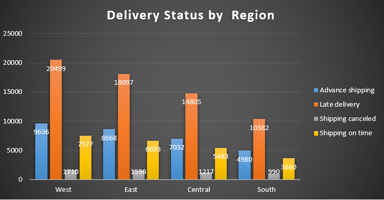

 From the chart above, we can observe the delivery performance by region and how it potentially affects sales.
#### West (Highest Sales Region)
The late deliveries (20,499) significantly outnumber on-time deliveries (9,636). There are also substantial numbers of advance shipping (7,577) and shipping cancellations (1,710).
#### Impact on sales
Despite high sales, the prevalence of late deliveries could negatively impact customer satisfaction, leading to the potential loss of repeat customers in the long term. Also, the high volume of advance shipping suggests proactive efforts to mitigate delays, which may partially offset customer dissatisfaction.

#### South (Lowest Sales Region)
the late deliveries (10,382) outnumber on-time deliveries (3,680) significantly. Shipping cancellations (990) are relatively low compared to other regions, but advance shipping (4,980) is also low.
#### Impact on sales
The low rate of advance shipping may indicate a lack of priority given to improving delivery timelines, further exacerbating customer dissatisfaction. Moreso, poor delivery performance likely discourages repeat purchases, contributing to the region’s low sales figures. 

### 7. How do the different shipping options affect delivery performance?
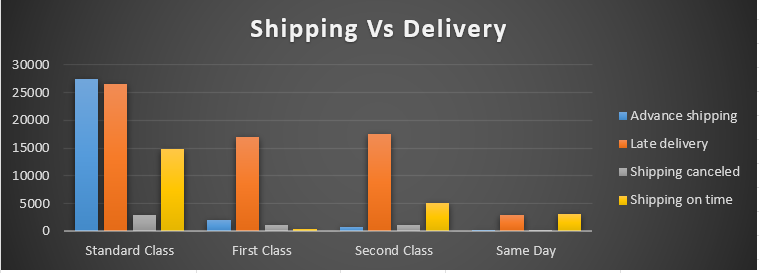

From the image above, we can make the following observations on the impact of the shipping options on delivery performance in different regions.
#### Standard Class:
This shipping type has the highest number of deliveries, but it also experiences the highest count of late deliveries (26,475). On-time deliveries are significantly lower (14,867), indicating a performance challenge in meeting deadlines.
#### First Class:
There are fewer shipments compared to Standard Class, but late deliveries (16,941) still dominate over on-time deliveries (5,379). This shows that while faster shipping is offered, there are still considerable delays.
#### Second Class:
Late deliveries (17,475) greatly outnumber on-time deliveries (5,110), similar to First Class, suggesting poor performance despite being a premium option.
#### Same Day:
This shipping type has the smallest volume of shipments, with late deliveries (2,892) still exceeding on-time deliveries (3,077). Although Same-day shipping performs relatively better in terms of proportions, it still struggles with delays.

#### Insights:
- Across all shipping options, late deliveries significantly outnumber on-time deliveries, showing a consistent issue with delivery performance.
- Despite having faster shipping options like First Class and Same Day, the rate of late deliveries does not improve drastically.
- This could indicate broader issues in the logistics chain that are not resolved by simply offering faster shipping.

### 8. What customer segment shows the most interest in a specific product or category?
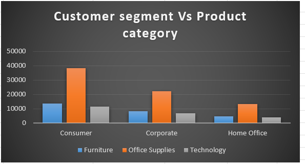

From the chart above, 
Corporate customers, consumers, and the Home office all show the most interest in Office Supplies as they all have the highest bar for this category compared to other categories.

## Recommendation
The summary of this project is presented in the dashboard below
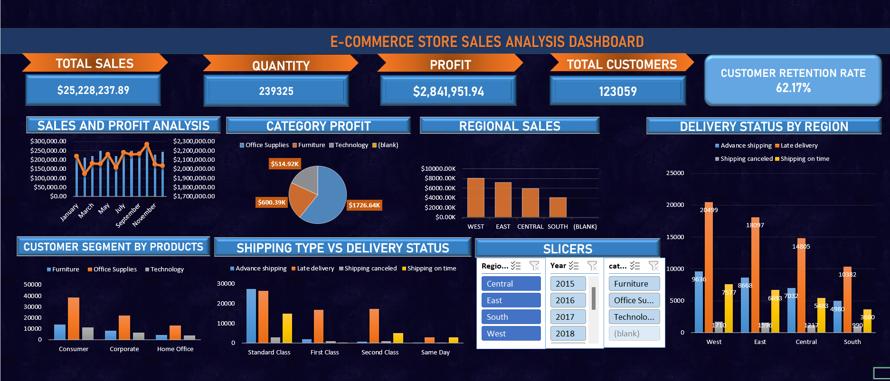
you can also interact with this dashboard here; https://docs.google.com/spreadsheets/d/1CO4p67tmtHqbapLDHyqeEmNxP1fNTuid/edit?usp=sharing&ouid=115538197328431932102&rtpof=true&sd=true

Based on the analysis and observations so far, I have come up with the following recommendations.
### 1. Improve Delivery Performance Across All Regions
Late deliveries dominate in every region, particularly in the West (highest sales region) and the South (lowest sales region). To address this, there is a need for the store to;
- Enhance logistics and supply chain processes to ensure timely deliveries.
- Consider partnering with reliable third-party delivery services to improve efficiency.
- Increase the use of advanced shipping to improve customer satisfaction, especially in regions like the South, where it's currently underutilized.

### 2. Focus on the South to Drive Sales Growth
The South has the lowest sales and a high proportion of late deliveries compared to on-time deliveries. To improve the sales in this region, it is recommended for the store to;
- Invest in targeted marketing campaigns to attract new customers in the region.
- Offer incentives such as discounts or free delivery to mitigate dissatisfaction caused by late deliveries.

### 3. Capitalize on the West’s Potential
The West leads in sales but has room for improvement due to high late deliveries and cancellations. This can be improved by strengthening the relationships with customers in the West by offering delivery guarantees or compensation for delays and promoting premium shipping options for time-sensitive orders with incentives for on-time performance.

